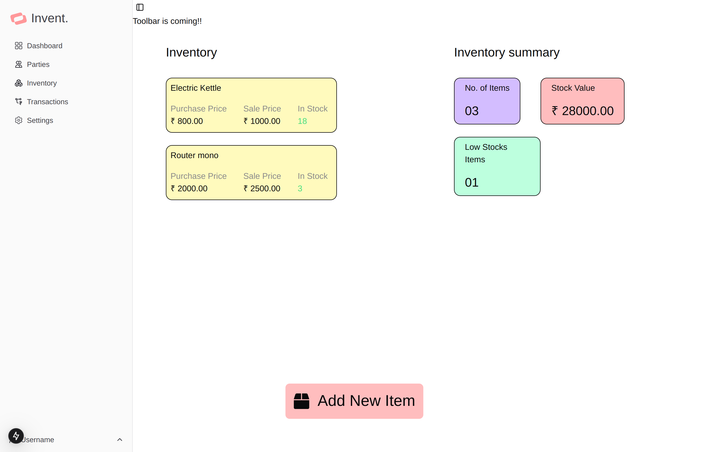
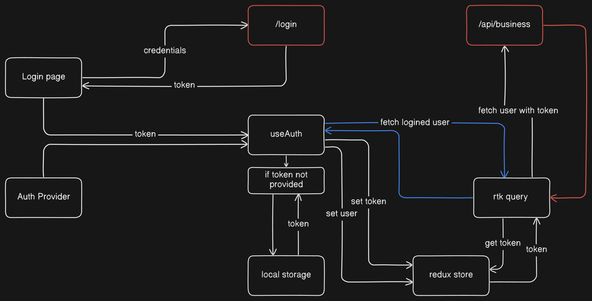

# Invent
A frontend for [Invent Backend](https://github.com/rishavmngo/Invent-backend.git)

## Inventory page

## Authentication Flow (left to right)

## Stack
1. Next js
2. Redux
3. Rtk Query
4. Tailwindcss
5. Shadcn UI
6. Zod

>Work in progress
